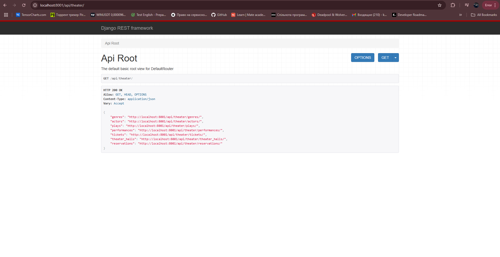
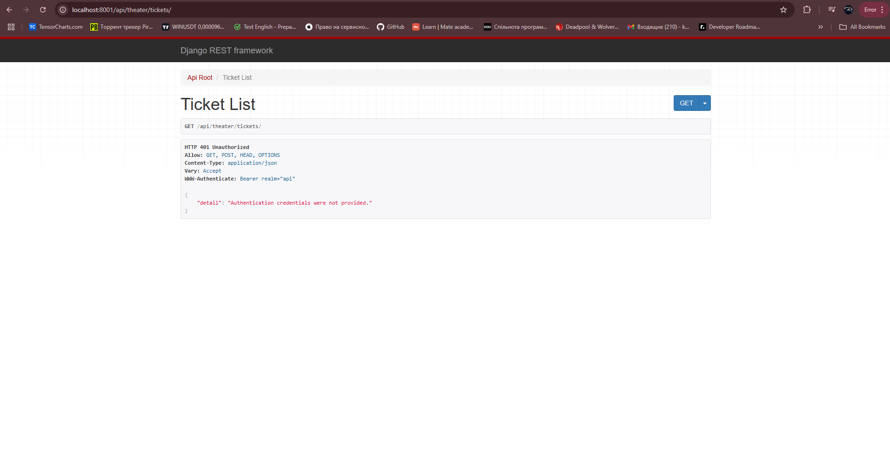
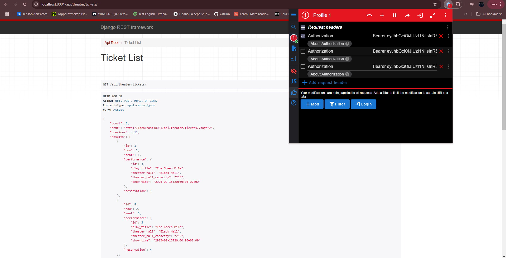

# Mystery Theater API

## **Description of the Project:**

This API project is a web application to manage theater performances, plays and book tickets mady with DRF

## **Technologies Used**
    ● **Backend**: Python 3.12.4, Django 5.2a1, Django REST Framework 3.15.2
    ● **DataBase**: PostgreSQL
    ● **Testing**: Django Test Framework
    ● **Other**: Pillow, PyYAML, psycopg2, pyflakes, pytz

## **Installation**

To run this project locally, execute the following commands in the terminal:

1. Clone the repository:
    ```bash
   git clone https://github.com/Koliesnichenko/mystery-theater.git

2. Navigate to the project directory:
     ```
   cd mystery-theater
     ```
3. Create a virtual environment:
    ```
    python -m venv venv
    ```
4. Activate the virtual environment:
    ● On Windows:
    ```
    venv\Scripts\activate
    ```
    ● On macOS or Linux:
   ```
    source venv/bin/activate
    ```
5. Install the required dependencies:
    ```
    pip install -r requirements.txt
    ```
6. Create a .env file in the root directory and add the following:
   ```ini
   POSTGRES_DB=<your_db_name>
   POSTGRES_USER=<your_db_user>
   POSTGRES_PASSWORD=<your_db_password>
   POSTGRES_HOST=<your_db_host>
   POSTGRES_PORT=5432

   # Django
   SECRET_KEY=your-secret-key
   DEBUG=True
   ```

7. Configure your database settings in settings.py:
   ```
   DATABASES = {
    "default": {
        "ENGINE": "django.db.backends.postgresql",
        "NAME": os.environ["POSTGRES_DB"],
        "USER": os.environ["POSTGRES_USER"],
        "PASSWORD": os.environ["POSTGRES_PASSWORD"],
        "HOST": os.environ["POSTGRES_HOST"],
        "PORT": os.environ["POSTGRES_PORT"],
        }
    }
    ```
8. Start project:
   ```
   python manage.py createsuperuser
   python manage.py migrate
   python manage.py loaddata dump.json
   python manage.py runserver
   ```

9. Start the project with Docker
   Run the following command to build and start the containers:
   ```
   docker-compose up --build -d
   ```
10. Apply migrations and load data once container is running:
   ```
   docker-compose exec theater python manage.py migrate
   docker-compose exec theater python manage.py loaddata dump.json
   ```

## **For getting access**
   ```yaml
   ● Email: admin@admin.com
   ● Password: admin12345
   ```

   Or you can create a user:
   ```yaml
   ● Create a user via /api/user/register/
   ● Get an access token via /api/user/token/
   ```

## **API endpoints**
   - /api/theater/genres/ - Manage Genres
   - /api/theater/actors/ - Manage Actors
   - /api/theater/plays/ - Manage Plays
   - /api/theater/performances/ - Manage Performances
   - /api/theater/tickets/ - Manage Tickets
   - /api/theater/theater_halls/ - Manage Theater halls
   - /api/theater/reservations/ - Manage Reservations

## **Screenshots**

### API list


### Auth required


### Access via ModHeader
